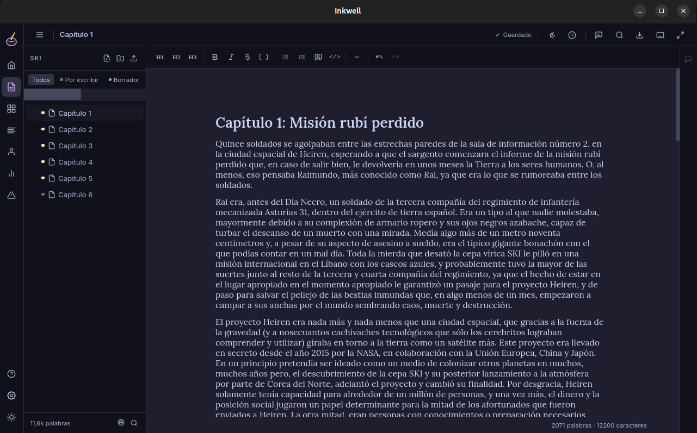

# ✒️ Inkwell

**El entorno de escritura libre para escritores.**

Inkwell es una aplicación de escritorio de código abierto para Linux diseñada para escritores de largo aliento. Organiza tu obra, escribe sin distracciones, y usa IA para mejorar tu narrativa — todo con tus archivos en tu disco, sin cuentas, sin suscripciones.



---

## ✨ Características

### Escribir

- **Editor enfocado** — tipografía serif, doble espaciado, modo focus y modo máquina de escribir
- **Snapshots** — guarda versiones de tu documento con un click y restaura cualquiera de ellas
- **Exportación profesional** — PDF en formato manuscrito estándar para editores, EPUB para ereaders, DOCX para Word
- **Importación** — importa documentos existentes en TXT, Markdown y DOCX

### Organizar

- **Binder ilimitado** — carpetas y capítulos con profundidad infinita, arrastrar para reordenar, filtrar por estado
- **Tableros de corcho** — tarjetas para personajes, investigación y notas, con imágenes generadas por IA
- **Vista narrativa** — todos tus capítulos como tarjetas con sinopsis y personajes asignados
- **Plantillas de proyecto** — empieza con una estructura predefinida o crea la tuya

### Potenciar con IA

- **Asistente de escritura** — analiza escenas, revisa texto, hace brainstorming contigo
- **Consistencia narrativa** — detecta contradicciones en nombres, descripciones y línea temporal
- **Sinopsis automáticas** — genera la sinopsis de cada capítulo con un click
- **IA flexible** — usa la API de Anthropic, un modelo local con Ollama, o cualquier servidor compatible

### Tus datos, tu control

- Archivos JSON en tu disco — legibles, versionables, portables
- Sincroniza con ProtonDrive, Syncthing o cualquier cliente de tu elección
- Sin cuentas. Sin servidores nuestros. Sin telemetría.

---

## 📦 Descargar

Descarga el instalador para tu sistema desde la [página de releases](../../releases).

| Plataforma            | Formato     |
| --------------------- | ----------- |
| Linux (Debian/Ubuntu) | `.deb`      |
| Linux (universal)     | `.AppImage` |

**Requisitos:** Linux 64-bit · ~200MB de espacio libre

---

## 🛠️ Compilar desde el código fuente

### Prerrequisitos

```bash
# Dependencias del sistema (Debian/Ubuntu)
sudo apt install -y \
  build-essential curl \
  libwebkit2gtk-4.1-dev libssl-dev \
  libayatana-appindicator3-dev librsvg2-dev

# Rust
curl --proto '=https' --tlsv1.2 -sSf https://sh.rustup.rs | sh
source "$HOME/.cargo/env"

# Node.js (via nvm recomendado)
curl -o- https://raw.githubusercontent.com/nvm-sh/nvm/v0.39.7/install.sh | bash
nvm install 22 && nvm use 22

# pnpm
npm install -g pnpm

# Tauri CLI
cargo install tauri-cli --version "^2"
```

### Compilar

```bash
git clone https://codeberg.org/TU_USUARIO/inkwell.git
cd inkwell
pnpm install
pnpm tauri build
```

Los artefactos se generan en `src-tauri/target/release/bundle/`.

### Modo desarrollo

```bash
pnpm tauri dev
```

---

## 🤖 Configurar la IA

Inkwell soporta tres proveedores de IA:

**Anthropic (nube)** — obtén una API key en [console.anthropic.com](https://console.anthropic.com) e introdúcela en Settings → IA.

**Ollama (local)** — instala [Ollama](https://ollama.ai), descarga un modelo y configura la URL en Settings → IA:

```bash
ollama pull llama3.2
# URL: http://localhost:11434
```

**Servidor OpenAI-compatible** — compatible con llama.cpp, LM Studio, LocalAI, Jan y otros. Introduce la URL de tu servidor en Settings → IA.

La IA es completamente opcional. Inkwell funciona sin ella.

---

## 🏗️ Stack técnico

| Capa     | Tecnología                                             |
| -------- | ------------------------------------------------------ |
| Desktop  | [Tauri 2](https://tauri.app)                           |
| Frontend | [Angular 19](https://angular.dev) (zoneless + signals) |
| Editor   | [TipTap 2](https://tiptap.dev)                         |
| Estilos  | [TailwindCSS](https://tailwindcss.com) · Catppuccin    |
| IA       | Anthropic API · Ollama · OpenAI-compatible             |

---

## 🤝 Contribuir

Las contribuciones son bienvenidas. Antes de abrir un pull request, abre una issue para discutir el cambio que quieres hacer.

```bash
# Fork del repo en Codeberg
# Crear una rama
git checkout -b feature/mi-mejora

# Hacer los cambios y commitear
git commit -m "feat: descripción del cambio"

# Push y abrir Pull Request
git push origin feature/mi-mejora
```

---

## 📄 Licencia

Inkwell es software libre distribuido bajo la licencia [MIT](LICENSE).

---

<div align="center">
  <sub>Hecho con ♥ para escritores · <a href="https://codeberg.org/frozenfangkb/inkwell">Codeberg</a></sub>
</div>
